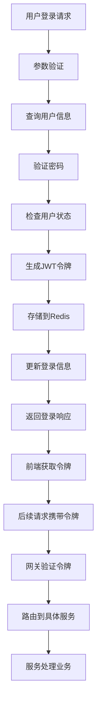

# 🚀 从零开始学习你的项目

## 📋 你的学习状态

✅ **已完成的工作：**
1. ✅ 项目架构梳理 - 理解了微服务架构设计
2. ✅ 学习指南创建 - 6阶段完整学习路径
3. ✅ 核心功能识别 - 6大核心模块深度分析
4. ✅ 面试准备要点 - 完整的问答手册
5. ✅ **AuthService完整实现** - 核心认证功能已实现

## 🎯 现在开始你的学习之旅

### 第1步：从认证服务开始（1-2周）

#### 🔑 理解认证流程



#### 📚 动手练习计划

**Week 1: 理论学习**
- [ ] 阅读项目学习指南 - 理解整体架构
- [ ] 深入理解AuthService.java - 每个方法的逻辑
- [ ] 学习JWT原理 - 令牌生成、验证、过期机制
- [ ] 理解Redis缓存应用 - 令牌存储、黑名单管理
- [ ] 跑通LoginRequest.java - 了解请求参数结构

**Week 2: 实践验证**
- [ ] 启动项目环境 - 确保Redis、MySQL正常运行
- [ ] 测试登录接口 - 使用Postman或测试类
- [ ] 测试注册接口 - 验证用户注册流程
- [ ] 测试令牌验证 - 验证JWT生成和验证逻辑
- [ ] 修改小功能 - 比如添加用户状态检查

### 第2步：深入核心业务（2-3周）

#### 📊 监控服务学习重点

**重点理解：**
1. **数据采集流程**
   ```
   传感器 → 上传接口 → Kafka生产者 → Kafka队列 → Kafka消费者 → 数据处理 → 数据库存储
                                                                 ↓
                                                             WebSocket推送 → 前端实时显示
   ```

2. **Redis缓存策略**
   ```
   查询请求 → 先查Redis缓存 → 缓存命中？→ 返回数据
       ↓                      否
       查询数据库 → 写入Redis缓存 → 返回数据
   ```

3. **WebSocket实时通信**
   ```
   前端 → 建立WebSocket连接 → 服务端接受连接
         ↓
   数据更新 → 服务端推送给该实验室的所有连接 → 前端实时更新图表
   ```

#### 🎯 实践建议

1. **数据监控练习**
   - 手动调用数据上传接口，观察Kafka消息处理
   - 修改告警规则，观察告警触发逻辑
   - 测试WebSocket推送，验证实时性

2. **缓存优化练习**
   - 测试Redis缓存命中率和性能提升
   - 模拟高并发场景，观察系统稳定性
   - 调整缓存过期时间和淘汰策略

3. **可视化集成练习**
   - 集成ECharts或AntV图表库
   - 实现实时数据展示
   - 添加历史数据查询功能

### 第3步：系统整合与优化（3-4周）

#### 🏗️ 微服务架构实践

**学习重点：**
1. **服务间通信**
   - HTTP同步调用：服务注册发现、负载均衡
   - Kafka异步通信：消息解耦、事件驱动
   - 配置中心：动态配置管理

2. **网关作用**
   - 统一入口：路由转发、认证过滤
   - 安全防护：限流、熔断、黑白名单

3. **数据库设计**
   - 表结构设计：索引优化、分区策略
   - 事务处理：数据一致性保证
   - 读写分离：性能优化

#### 💡 学习方法建议

1. **先读代码再动手**
   - 先理解每个类的作用和职责
   - 画出类之间的关系图
   - 思考为什么这样设计

2. **逐步修改验证**
   - 修改一个小功能后立即测试
   - 使用单元测试验证逻辑
   - 使用集成测试验证流程

3. **记录学习笔记**
   - 每天总结学到的技术点
   - 记录遇到的问题和解决方法
   - 思考可以优化的地方

## 🔥 面试准备策略

### 📝 必须掌握的核心概念

1. **微服务架构**
   ```
   问题：为什么要用微服务？
   回答：单体服务 → 耦合严重、部署困难、扩展性差
          微服务 → 服务拆分、独立部署、技术选型灵活
   ```

2. **JWT认证机制**
   ```
   问题：JWT的优势和安全性？
   回答：优势 - 无状态、跨域支持、包含用户信息
          安全 - 密钥管理、过期控制、防篡改
   ```

3. **缓存策略**
   ```
   问题：如何解决缓存穿透、击穿、雪崩？
   回答：穿透 - 缓存空值、布隆过滤器
          击穿 - 互斥锁、热点数据永不过期
          雪崩 - 随机过期时间、熔断降级
   ```

4. **消息队列**
   ```
   问题：Kafka的作用和优势？
   回答：异步解耦、削峰填谷、数据可靠性
          事件驱动、顺序保证、持久化存储
   ```

### 🎭 项目亮点总结

1. **技术架构亮点**
   - 微服务架构：Spring Cloud + Nacos
   - 实时监控：WebSocket + Kafka异步处理
   - 高性能缓存：Redis多级缓存策略
   - 完整认证：JWT + Redis黑名单管理

2. **业务功能亮点**
   - 实时数据监控：毫秒级数据推送
   - 智能告警系统：多维度阈值告警
   - 数据统计分析：日报、月报、趋势分析
   - 系统可靠性：异常处理、重试机制、降级策略

3. **代码质量亮点**
   - 统一异常处理：完善的日志记录
   - 参数验证：严格的输入校验
   - 安全考虑：密码加密、SQL注入防护
   - 可扩展设计：配置化、模块化

## 🎯 你的行动计划

### 每日学习任务

**第1周：基础掌握**
- [ ] 完整理解AuthService.java每个方法
- [ ] 使用Postman测试所有认证接口
- [ ] 修改一个小功能并测试
- [ ] 写一篇学习笔记总结

**第2周：核心业务**
- [ ] 理解MonitorService.java核心逻辑
- [ ] 测试数据上传和Kafka处理
- [ ] 实现一个简单告警规则
- [ ] 搭建一个简单的WebSocket测试页面

**第3周：深入优化**
- [ ] 理解缓存策略的实现细节
- [ ] 优化一个查询接口性能
- [ ] 实现数据导出功能
- [ ] 准备项目部署文档

**第4周：综合应用**
- [ ] 完整走一遍项目部署流程
- [ ] 准备项目演示PPT
- [ ] 模拟面试问题并回答
- [ ] 总结项目技术难点和解决方案

### 💡 成功标准

当你能够：
1. **清晰解释项目架构** - 为什么用微服务，每个服务的作用
2. **详细说明核心流程** - 认证流程、数据处理流程、实时通信流程
3. **回答技术细节问题** - JWT实现原理、缓存策略、消息队列应用
4. **指出可以优化的地方** - 性能优化、安全增强、功能扩展
5. **展示实际操作** - 演示系统使用、排查问题、修改代码

## 📞 学习资源

### 必读文档
1. `项目学习指南.md` - 6阶段详细学习路径
2. `核心功能详解.md` - 6大核心模块技术分析
3. `面试问答手册.md` - 完整的面试问题和标准答案
4. `使用指南-从零开始学习.md` - 本文档，行动计划

### 代码学习顺序
1. `auth-service` → 认证服务（最容易理解）
2. `gateway-service` → 网关服务（理解微服务入口）
3. `monitor-service` → 监控服务（核心业务，最复杂）
4. `system-service` → 系统服务（配置管理）

### 🚨 重要提醒

1. **不要急于求快** - 理解原理比记住代码更重要
2. **多动手实践** - 理论结合实践，才能真正掌握
3. **保持持续学习** - 每天进步一点，积累成实力
4. **遇到问题及时请教** - 技术问题不要积压，及时解决

---

**现在开始你的学习之旅吧！记住：这个项目是你自己的，理解它、掌握它、能够自信地向面试官展示它！** 🚀